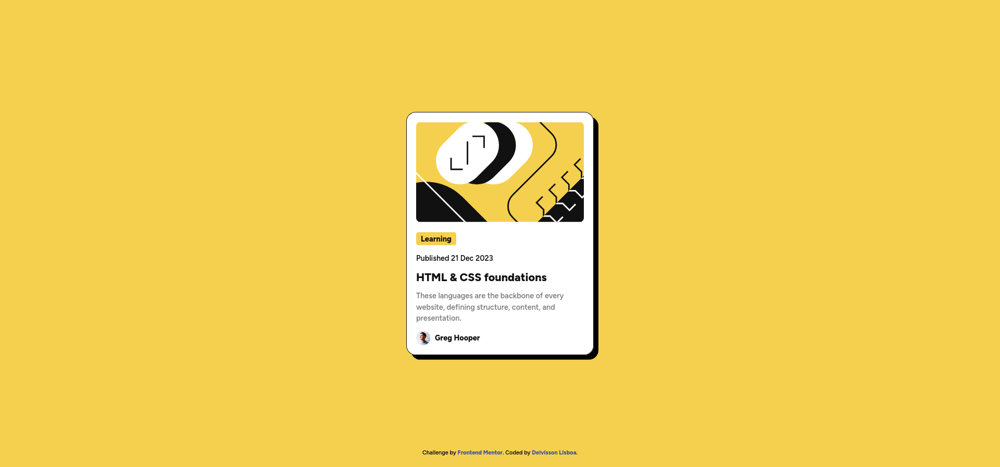

# Frontend Mentor - Blog preview card solution

This is a solution to the [Blog preview card challenge on Frontend Mentor](https://www.frontendmentor.io/challenges/blog-preview-card-ckPaj01IcS). Frontend Mentor challenges help you improve your coding skills by building realistic projects.

## Table of contents

- [Overview](#overview)
  - [The challenge](#the-challenge)
  - [Screenshot](#screenshot)
  - [Links](#links)
- [My process](#my-process)
  - [Built with](#built-with)
  - [Useful resources](#useful-resources)
- [Author](#author)

## Overview

### The challenge

Users should be able to:

- See hover and focus states for all interactive elements on the page

### Screenshot

### Links

- Solution URL: [https://www.frontendmentor.io/solutions/blog-preview-card-using-cube-css-ohmoN-T1xz](https://www.frontendmentor.io/solutions/blog-preview-card-using-cube-css-ohmoN-T1xz)
- Live Site URL: [https://deivissonlisboa.github.io/blog-preview-card-main](https://deivissonlisboa.github.io/blog-preview-card-main)

## My process

### Built with

- CUBE CSS
- CSS custom properties
- CSS Grid

### Useful resources

- [CUBE CSS](https://cube.fyi) - This helped me write a better and more readable CSS structure.
- [A look at the CUBE CSS methodology in action - Kevin Powell](https://www.youtube.com/watch?v=NanhQvnvbR8) - Amazing video by one of my favorite CSS youtubers.

## Author

- Frontend Mentor - [@DeivissonLisboa](https://www.frontendmentor.io/profile/DeivissonLisboa)
